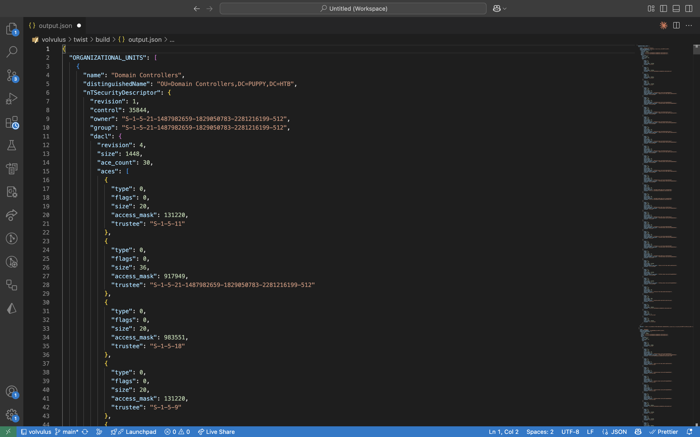

  <h3 align="center">Volvulus Twist</h3>
  
Generate a dump of an Active Directory's data.

## What is this?

This is an active directory enumeration tool which connects through local directory access protocol (LDAP) and dumps organizational units (OUs), groups and users into a clean JSON output file. **That thing is going to need a little rewrite at some point because the code is very messy**.

## Build

Make sure to install OpenLDAP on your system as it's the only dependency this tool requires.

1. Create a `build/` folder and go into it.
2. Run `cmake ..`.
3. Run `cmake --build .`.
4. You should now have a `VolvulusTwist` executable ready.

## Usage

It requires the following arguments:

- `-u` : The user to authenticate with.
- `-p` : The user's password.
- `-h` : The host's IP.
- `-d` : The active directory domain.
- `-s` : When present TLS should be used (you give it no additional value).
- `-sp` : The server port (defaults to 389).

If it corretly connect to the server you should end up with an `output.json` file in the working directory.

### Footage

## Update plans

- [x] Setup an actual JSON generation system. The current string stream system is far too ugly and confusing for anyone to understand.
- [] Find a way to support TLS connection.
- [] Improve README (maybe look at templates)
- [] Improve code readability and establish contribution guide
